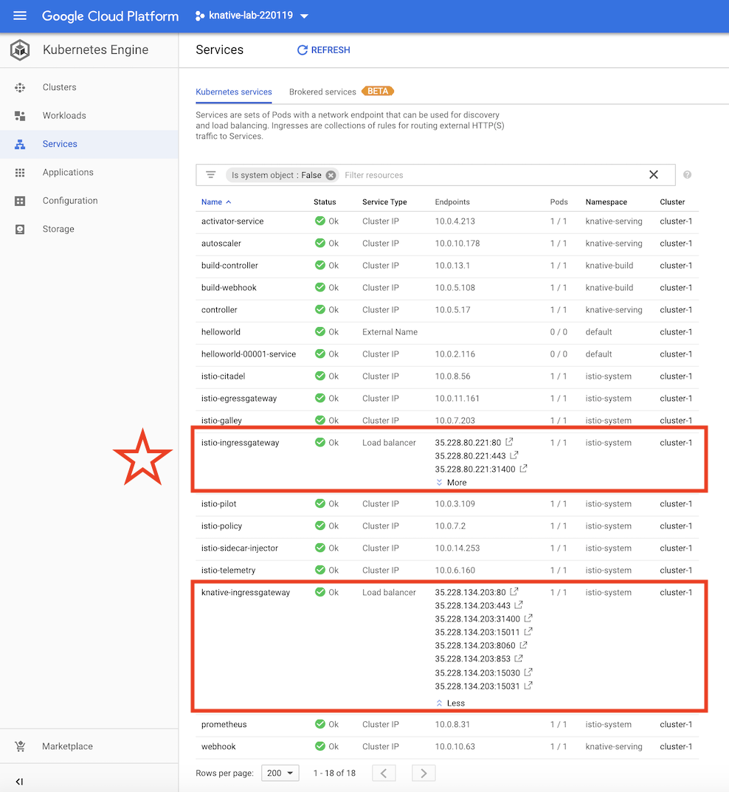

# Knative Lab

><font color=red>NOTE: This is work-in-progress. You should use `knative-ingress` (not `istio-ingress` as this doc implies). Will try to update the instructions.
</font>

Getting started with Knative on Google Kubernetes Engine.

<font size="+5">🎯</font> Aim:

- Able to serve an API end point, using Knative (dynamic scaling up/down)
- Able to authenticate access to such end point
- Logging
- Accessing the end point via a DNS name (e.g. `something.i.hold`)
- `https://` access, only
- "GitOps" approach, i.e. changes to the end point come via changes to this repo

## Sources

- knative docs > [Installing Knative](https://github.com/knative/docs/blob/master/install/README.md)
- Google CodeLabs > [Using Knative to deploy serverless applications to Kubernetes](https://codelabs.developers.google.com/codelabs/knative-intro/#0) <font size="+2">🥇</font>
- [Knative Install on Google Kubernetes Engine](https://github.com/knative/docs/blob/master/install/Knative-with-GKE.md) (GitHub)
  
## Requirements

You have:

- a Google Cloud account
  - GKE enabled within that project (with Kubernetes v1.11 or newer)
- and [`gcloud` installed](https://cloud.google.com/sdk/install)

### Command line tools

Have [gcloud installed](https://cloud.google.com/sdk/install) (Google Cloud docs). 

```
$ gcloud init     # select right GCP account and project
```

If you don't already have `kubectl` from `gcloud`, install it  (note: this likely means you shouldn't have a non-GCP `kubectl` installed): 

```
$ gcloud components install kubectl
```

>Note: If you've installed `kubectl` earlier, check that it is "1.10 or newer" with `kubectl version`.

### Kubernetes cluster

You can create the cluster in the Google Cloud Console. [^1] In "advanced settings":

- `Networking` > `VPC-native` > `[x] Enable VPC native (using alias IP)` <sub>[details](https://cloud.google.com/kubernetes-engine/docs/how-to/alias-ips?hl=en_US&_ga=2.193848357.-966989269.1542020118&_gac=1.155356873.1547648787.CjwKCAiAyfvhBRBsEiwAe2t_i2Sx9xEckJFlzuzmzZYqnJwTjM2cwjU3AlxjppH9MPEtQa5w7QnXvhoCU_EQAvD_BwE)</sub>
  - this is "soon going to be default" so no reason not to
- `Load balancing` > `[ ] Enable HTTP load balancing`; you can likely switch this off since we're using Istio. <font color=red>tbd. try out</font>
- `Additional features` > `[x] Try the new Stackdriver beta Monitoring and Logging experience`
- <strike>`[x] Enable Istio`</strike>
- version 1.11.x
- 4 vCPU nodes (`n1-standard-4`)[^2]
- Node autoscaling, 1..10 nodes
- API scopes for `cloud-platform`, `logging-write`, `monitoring-write`, and `pubsub` [^3]

Part of these settings come from [Official instructions](https://github.com/knative/docs/blob/master/install/Knative-with-GKE.md).

[^1]: [Knative instructions](https://github.com/knative/docs/blob/master/install/Knative-with-GKE.md) also provide command line version

[^2]: Took "small" (tbd. write here if it worked)

[^3]: Knative instructions tell "if required", but not sure how to tell. Maybe it just refers to the PubSub scope.


**Istio**

GKE cluster wizard offers installation of Istio but Knative has its own yaml's:<sub>[source](https://github.com/knative/docs/blob/master/install/Knative-with-GKE.md#installing-istio)</sub>

```
$ kubectl apply --filename https://github.com/knative/serving/releases/download/v0.3.0/istio-crds.yaml && \
$ kubectl apply --filename https://github.com/knative/serving/releases/download/v0.3.0/istio.yaml
```

Install with those, since it's in the docs.

Also, the instructions state:

```
$ kubectl label namespace default istio-injection=enabled
```

<!-- disabled (only asked if ticking Istio in the cluster creation)
**Istio: Permissive or strict mTLS mode?**

See [here](https://istio.io/docs/reference/config/istio.authentication.v1alpha1/#MutualTls-Mode):

- "permissive" allows http as well as https (right?), and does not require requests to be carrying a certificate

><font color=red>Confirm the above, once more experienced.</font>
-->

**Grafana**

You may want to enable Grafana (there's a tick for it, right?). The Google codelabs uses it on page 10.

---

Once these are done, check that everything gets up nicely:

```
$ kubectl get pods --namespace istio-system
```


### Configuring the command line tools

Configure cluster access for kubectl <sub>[source](https://cloud.google.com/kubernetes-engine/docs/how-to/cluster-access-for-kubectl)</sub>:

```
$ gcloud container clusters get-credentials cluster-1
...
```

You should now be able to reach the cluster:

```
$ kubectl get nodes
NAME                                       STATUS    ROLES     AGE       VERSION
gke-cluster-1-default-pool-835ba868-bmss   Ready     <none>    7m        v1.10.9-gke.5
gke-cluster-1-default-pool-835ba868-rh6c   Ready     <none>    7m        v1.10.9-gke.5
gke-cluster-1-default-pool-835ba868-v30c   Ready     <none>    7m        v1.10.9-gke.5
```

## Installing Knative

With `kubectl` pointing to a cluster with Istio installed, we can install Knative on it.[^1]

[^1]: Google has something called [GKE Serverless addon](https://docs.google.com/forms/d/e/1FAIpQLSdG5cCIiHhkW7srw9MWvdiLEsLXwJES1R3lnKgAn-opy3_iuQ/viewform) in the works; it may be a better way to get started, but requires opt-in approvement for now (Jan-19).

### Prime the cluster

Give your account `cluster-admin` role on the cluster (necessary to install Knative):<sub>[source](https://codelabs.developers.google.com/codelabs/knative-intro/#2)</sub>

```
$ kubectl create clusterrolebinding cluster-admin-binding \
  --clusterrole=cluster-admin \
  --user=$(gcloud config get-value core/account)
...
clusterrolebinding.rbac.authorization.k8s.io "cluster-admin-binding" created
```

<!-- disabled (we don't use it in install)
### Pick the version

Let's see the latest version from [releases](https://github.com/knative/serving/releases) (GitHub).

>0.3 is the first release of our new schedule of releasing every 6 weeks.

>Kubernetes 1.11 is now required
-->

### Install

```
$ kubectl apply --filename https://storage.googleapis.com/knative-releases/build/latest/release.yaml
```
<sub>[source](https://github.com/knative/docs/blob/master/build/installing-build-component.md#adding-the-knative-build-component)</sub>

<!-- hidden note
>Note: In addition to that, also this *may* be needed:
>
>`$ kubectl apply --filename https://github.com/knative/serving/releases/download/v0.3.0/serving.yaml`
-->

Check that Knative stuff is up:

```
$ kubectl get pods --namespace=knative-serving
NAME                          READY     STATUS    RESTARTS   AGE
activator-598b4b7787-42lrg    2/2       Running   0          4m
autoscaler-5cf5cfb4dc-vqllk   2/2       Running   0          4m
controller-7fc84c6584-4bh4q   1/1       Running   0          4m
webhook-7797ffb6bf-qv7fr      1/1       Running   0          4m
```

:)

### Alternative instructions (side track)

Knative with GKE page has [different installation instructions](https://github.com/knative/docs/blob/master/install/Knative-with-GKE.md#installing-knative).

They install all the bits, not just `serving`, and also check that all of those are up.


### Which version did we get?

We installed `latest` - what did we end up with?

```
$ kubectl describe deploy controller --namespace knative-serving
...
    Image:      gcr.io/knative-releases/github.com/knative/serving/cmd/controller@sha256:5a5a0d5fffe839c99fc8f18ba028375467fdcd83cbee9c7015c1a58d01ca6929
...
```

Now we're going a bit to the ditch. Hang on. 🧗‍♀️

Pick the image URL. Cut it at the `@sha256:`.

```
$ gcloud container images list-tags gcr.io/knative-releases/github.com/knative/serving/cmd/controller | grep 5a5a0d
5a5a0d5fffe8  gke-1.11.6,latest,v0.3.0                                1970-01-01T02:00:00
```

Here, we caught the image is tagged `latest` and `v0.3.0` so that's what we got. :)

---

>Note: This was inspired by [these instructions](https://github.com/knative/docs/blob/master/install/check-install-version.md).

---

## Then what?

```
$ kubectl apply -f helloworld.yaml
service.serving.knative.dev "helloworld" created
```

🎬
You should now follow the codelabs page. Come back at the end of page 7.

---

To get the IP where the service is reachable:

```
$ kubectl get service --namespace=istio-system istio-ingressgateway -ojson \
  | jq '.status.loadBalancer.ingress[0].ip' --raw-output
35.228.80.221
```

Note: this differs from the tutorial's instructions: use `istio-ingressgateway` instead of `knative-ingressgateway`.

><font color=red>tbd. Uncertain if that change is correct.</font>

<!-- disabled
Did the `curl` command fail like this?

```
$ curl -H "Host: helloworld.default.example.com" http://35.228.134.203 
curl: (7) Failed to connect to 35.228.134.203 port 80: Connection refused
```

There's been a change in Knative 0.3.0 (the codelabs used 0.2.1 at the time of writing this):

>Use the default gateway istio-ingressgateway by default (@lichuqiang)
>
>We have deprecated the Knative copy of the Istio ingress gateway.

There are two gateways at play. Check at GCP Console > Kubernetes Engine > Services:



The `istio-ingressgateway` here is at `35.228.80.221`. It responds:
-->

```
$ curl -H "Host: helloworld.default.example.com" http://35.228.80.221
Hello world!
```

## The rest is downhill... 🚴‍♂️ (you wish!!!)

Carry on following the codelabs tutorial. 

Some notes here.

### Nesting the canary

Curling to the "canary" may initially provide 404. This is simply the delay when the service is being set up (after `apply`). Eventually:

```
$ curl -H "Host: canary.default.example.com" http://35.228.80.221
<!DOCTYPE html>
<html lang="en">
<head>
    <title>Knative Routing Demo</title>
    <link rel="stylesheet" type="text/css" href="/css/app.css" />
</head>
<body>
            <div class="blue">App v1</div>
    </div>
</body>
```

*Heh, there's a loose tag in there. ;)*

### Autoscaling does not respond

```
$ curl --header "Host: autoscale-go.default.example.com" \
  "http://${IP_ADDRESS?}?sleep=1000"
```

><font color=red>That call does not respond.</font>

### Monitoring

```
$ kubectl port-forward --namespace knative-monitoring \
  $(kubectl get pods --namespace knative-monitoring \
      --selector=app=grafana --output=jsonpath="{.items..metadata.name}")\
  8080:3000
```

Ok, hadn't clicked "graphana" to be included in the cluster.

Also, page 10 requires `go` [to be installed](https://golang.org/doc/install#macos) (did not try).


### Building (pages 11..13) - skipped

Did not have need for Knative build - [Google Cloud Build](https://cloud.google.com/cloud-build/) does similar.


## Summary

Did not get things fully to work. Have reported the problems in some forums - and at due time the tutorial itself will get updated to Knative 0.3.0.

In the mean time, I got granted access to [GKE Serverless](https://docs.google.com/forms/d/e/1FAIpQLSdG5cCIiHhkW7srw9MWvdiLEsLXwJES1R3lnKgAn-opy3_iuQ/viewform) (application form) and will try it out, instead.


## Appendices

### Upgrading Kubernetes

GKE tries to make upgrading Kubernetes easy. Let's collect here experiences about doing so in practise.

#### 22-Jan-2019 (1.10.x -> 1.11.6-gke.2)

- took ~15min but really smooth

### Knative support channels

- [knative-users](https://groups.google.com/forum/#!forum/knative-users) (Google groups)
  - official channel, but very little traffic in early 2019

### Issues to track

- "Race Condition installing Serving from Release 0.3.0 yaml" [#2940](https://github.com/knative/serving/issues/2940)
- "Getting started with Knative 0.3.0 on GKE" [#2966](https://github.com/knative/serving/issues/2966)


### Troubleshooting

If things don't work, check this:

```
$ kubectl get pods --namespace istio-system
NAME                                      READY     STATUS             RESTARTS   AGE
istio-citadel-776fb85794-kf7cv            1/1       Running            0          1d
...
knative-ingressgateway-56d46fcb88-dz59h   0/1       CrashLoopBackOff   274        1d
...
```

```
$ kubectl logs knative-ingressgateway-56d46fcb88-dz59h -n istio-system
...
[2019-01-24 05:36:04.607][50][critical][main] external/envoy/source/server/server.cc:78] error initializing configuration '/etc/istio/proxy/envoy-rev0.json': malformed IP address: istio-statsd-prom-bridge
...
```

Hmmm...

